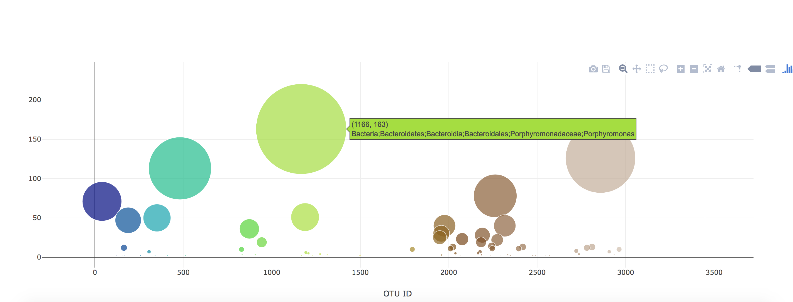

# Belly Button Biodiversity

In this assignment, created a interactive dashboard to explore the [Belly Button Biodiversity DataSet](http://robdunnlab.com/projects/belly-button-biodiversity/).

## Step 1 - Plotly.js

Used Plotly.js to build interactive charts for your dashboard.

* Created a PIE chart that uses data from your samples route (`/samples/<sample>`) to display the top 10 samples.

  * Used `sample_values` as the values for the PIE chart

  * Used `otu_ids` as the labels for the pie chart

  * Used `otu_labels` as the hovertext for the chart

  

* Created a Bubble Chart that uses data from your samples route (`/samples/<sample>`) to display each sample.

  * Used `otu_ids` for the x values

  * Used `sample_values` for the y values

  * Used `sample_values` for the marker size

  * Used `otu_ids` for the marker colors

  * Used `otu_labels` for the text values

  

* Displayed the sample metadata from the route `/metadata/<sample>`

* Displayed each key/value pair from the metadata JSON object somewhere on the page

* Updated all of the plots any time that a new sample is selected.

* An example dashboard page looks like the following.

## Step 2 - Heroku

Deployed the Flask app to Heroku.

- - -

### Copyright

Data Boot Camp © 2018. All Rights Reserved.
